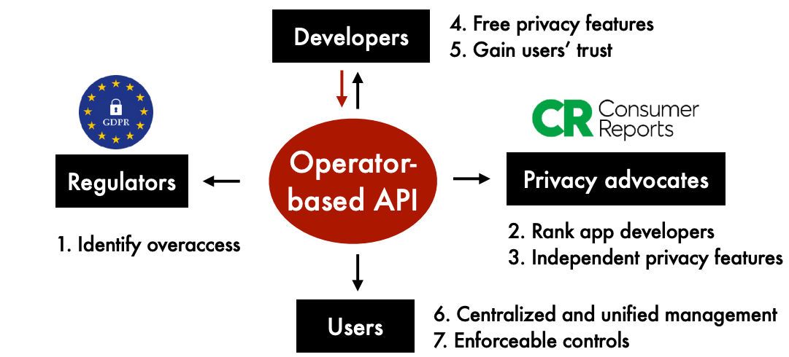

# Let the good privacy drive out the bad privacy

## My background

I am Haojian Jin, an Assistant Professor in Halıcıoğlu Data Science Institute at UC San Diego. I recently graduated from Human-Computer Interaction Institute at Carnegie Mellon University. My Ph.D. dissertation proposes a [new way](http://haojianj.in/resource/pdf/modular-privacy-flows-short-summary.pdf) to design, implement, and interact with permissions in the interest of privacy. 

## Topic

I hope to lead discussions on creating a virtuous cycle ecosystem for privacy. My position statement has three key ideas.

- First, future developers should collect users' data on a **need-to-know** basis and implement it in a **transparent** and **structured** manner.

- Second, we should not expect users to manage permissions actively. Many studies find that users do not have the expertise and time. I argue that **many low-risk fine-grained permissions can be granted by default**. Our goal, instead, is to empower third-party auditors and privacy advocates in the ecosystem and disincentivize developers from using unnecessary permissions. For example, consumer reports may rank app developers by privacy. App stores can inform users of the potential privacy risks during installation. 

- Third, most users will rely on trusted third parties to manage their permissions aggregately. For example, a trusted third party may develop [Privacy Diagnostics](http://haojianj.in/resource/pdf/privacy-speeddating.pdf), similar to security
diagnostics in anti-virus software, to help users identify and fix suspicious permissions. 

The discussion would be more about "what if" rather than "how." 
Here I enumerate a few potential discussion examples: 

- What are the potential drawbacks of this new paradigm?
- When would this new paradigm fail?
- What are the low-risk fine-grained permissions? 
- When do we need approvals from users? For example, assuming a system offers a differential privacy guarantee, can we grant permission by default? 

## Links to support materials

1. [Modular Privacy Flows - 3 page summary of my Ph.D. dissertation](http://haojianj.in/resource/pdf/modular-privacy-flows-short-summary.pdf) 
    - This document describes "how" to enable the virtuous cycle ecosystem. The high-level idea is to replace all-or-nothing binary APIs with operator-based APIs. 
    - [Operator-based Data Access for Protecting Users’ Privacy](http://haojianj.in/presentations/2022-09-15-HDSI-industry.pdf) further summarizes the idea of creating a virtuous cycle ecosystem for privacy. 

2. [Peekaboo - IEEE S&P](http://haojianj.in/resource/pdf/peekaboo-oakland22.pdf)
    - PPeekaboo is a prototype system I have built to demonstrate the vision I described above. It leverages an in-home hub to pre-process and minimize outgoing data in a structured and enforceable manner before sending it to external cloud servers.

3. [Exploring the Needs of Users for Supporting Privacy-Protective Behaviors in Smart Homes - SIGCHI 2022](http://haojianj.in/resource/pdf/privacy-speeddating.pdf)
    - This paper compares 11 different privacy protection concepts with 227 participants, offers a list of the pros and cons for each concept, and ranks these design concepts.
